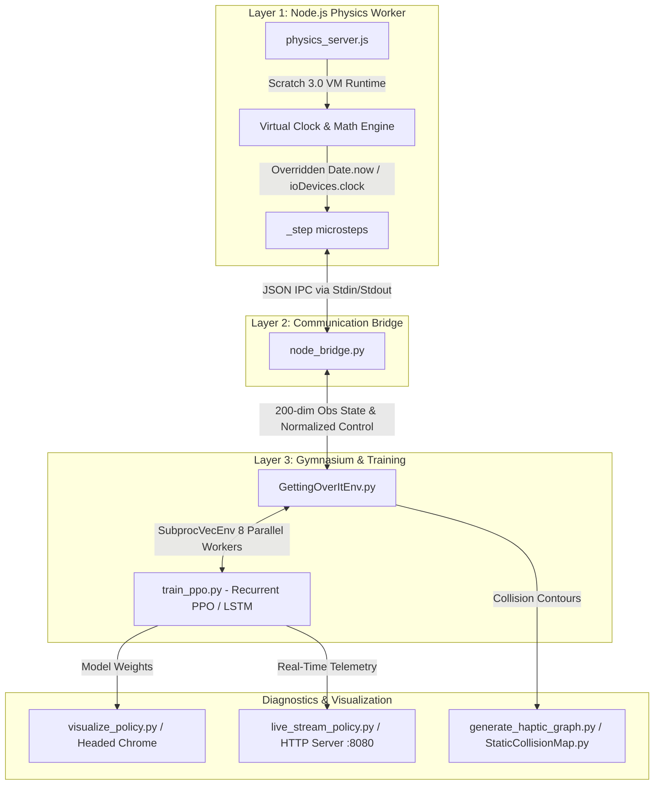

# RL-Over-It

Research infrastructure for Griffpatch's **Getting Over It v1.4**, Scratch project
[389464290](https://scratch.mit.edu/projects/389464290/).

> **Open challenge.** The environment, scoring, and gates are published and the
> RL method is entirely up to you. The goal is to beat a hand-designed controller
> that holds the first ledge. See [`docs/CHALLENGE.md`](docs/CHALLENGE.md) and
> `challenge/`. Before redistributing anything here, read [`NOTICE`](NOTICE):
> the game assets are third-party and are **not** covered by the code license.

**Status: validated early-game control, not a solved game or a competent trained agent.**
An audit found that the old Node backend disabled the very collision queries
used by the game's physics. Its training results are not valid gameplay evidence.
The claimed starting height of -264.7 was also incorrect: the real starting
terrain supports the player at **Y = 21**.

## Current workflow

Use `research/`, not the legacy environment, trainer, or action-file streamer.
It executes the downloaded game scripts with their **real TurboWarp renderer**,
synchronously steps the game, and checks causal control before learning.
It does not approximate the physics or connect a cloud-score provider.

See [`docs/RESEARCH_AUDIT.md`](docs/RESEARCH_AUDIT.md) for measured findings,
architecture choices, literature, failure analysis, and outstanding work.
See [`docs/REWARD_DESIGN.md`](docs/REWARD_DESIGN.md) for the current versioned
reward, physical-time discount, exploit tests, and sparse/height/settled ablations.
See [`docs/REMOTE_TRAINING.md`](docs/REMOTE_TRAINING.md) for the experiment matrix.
See [`docs/FAST_BACKEND.md`](docs/FAST_BACKEND.md) for the implemented accelerated
original-runtime backend, measured speedups, and reference-fidelity gates.
See [`docs/RESEARCH_CAMPAIGN.md`](docs/RESEARCH_CAMPAIGN.md) for the physical
first-obstacle benchmark, controlled pilot, resource measurements, and guarded
follow-up/scale criteria.
The private Hugging Face deployment and managed remote pilot are documented
in [`docs/HF_DEPLOYMENT.md`](docs/HF_DEPLOYMENT.md), including automatic pause,
durable artifacts, and the runtime cap.

### Setup

Python 3.11, Chrome/Chromium, and a compatible PyTorch installation are required.
The tested versions are in `requirements-research.txt`.
The downloaded `Getting Over It v1/assets/` and `script.js` must be present.
Node dependencies are only needed for the **legacy comparison**, not training.

```powershell
python -m pip install -r requirements-research.txt
python -m unittest discover -s tests -p "test_*.py" -v
node tests/collision_memo.test.js
python -m research.validate
python -m research.diagnose --ticks 240
python -m research.compare_runtime
python -m research.reward_audit
python -m research.fast_fidelity
python -m research.policy_fidelity --decisions 128
python -m research.campaign prepare
```

When Factory's embedded browser is available, `auto` uses it visibly.
On a separate training host, `--driver selenium` creates an isolated browser.
Only a loopback asset server is used. Closing a bridge never closes the
user's embedded browser.

### Bounded local checks, not real training

```powershell
python -m research.trajectory_search --population 8 --iterations 3 --ticks 360
python -m research.train --algorithm ppo --smoke --steps 512 --action absolute
python -m research.train --algorithm sac --smoke --steps 512 --action velocity
```

Training now defaults to the accelerated original engine (`--backend fast`).
It keeps the real collision renderer and original physics, with exact
per-tick collision reuse and persistent local transport. Evaluation always
uses an uncached reference worker. Select `--backend reference` for an
unaccelerated training ablation.

Local smoke runs use CPU and are capped at **2,048 transitions**.
Full training requires `--remote-training` on a separate host and is refused
in this desktop environment. No full training was run during the audit.
The current `climb-v2` reward has a 120-second discount half-life shared by
the environment and learner. Choose `--reward-profile sparse`, `height`, or
`settled` (default). Observation normalization is saved; rewards stay in raw
task units without dynamic normalization or clipping. Earlier checkpoints
predate the new telemetry/reward-history contract and are not resumed.

Runs create unique directories under `artifacts/`, containing configurations,
physical traces, evaluations, and model/normalization files where applicable.
For a trusted model generated by this harness:

```powershell
python -m research.replay --trial "D:\absolute\path\to\trial_directory" --decisions 256
python -m research.replay --search "D:\absolute\path\to\search.json"
```

The small trajectory baseline retained **34 units of height**, including a
120-tick hold afterward. The 512-transition PPO and SAC checks exercised the
pipeline but did **not** establish policy learning. Do not report transient
jumps, losses, shaped reward, or deterministic replay seeds as climb completion
or generalization.
The newer first-ledge baseline found a per-tick trajectory that lands and holds
the raised platform at body Y=104. Resampling it to four-tick RL actions fails;
a bounded four-tick search has not achieved the hold. This timing/feedback
risk is explicitly tracked, not treated as proof of RL feasibility.

No license file was found during the audit. Resolve the code license and game
asset attribution/redistribution terms before public release.

---

<details>
<summary>Historical prototype documentation, superseded and containing disproven claims</summary>

The material below is retained for forensic context only. In particular, the
renderer-free physics claim, Node throughput as meaningful gameplay throughput,
old rewards, reset heights, installation instructions, and training commands
are **not** the current contract. The legacy trainer and default environment
now fail explicitly instead of silently launching invalid training.

## Historical Getting Over It bridge

[](https://www.python.org/)
[](https://nodejs.org/)
[](https://gymnasium.farama.org/)
[](https://github.com/Stable-Baselines-Team/stable-baselines3-contrib)
[](LICENSE)

An ultra-fast, headless **Scratch VM Physics Server Bridge** and **Gymnasium Reinforcement Learning Environment** for Bennett Foddy's *Getting Over It* (Scratch Edition, ID: 389464290).

By executing `scratch-vm` headlessly under Node.js with virtual clock patching, this framework achieves simulation throughput of **>750 to 4,500+ physics steps per second** — completely eliminating display overhead and native browser rendering bottlenecks.

---

## 📐 Architecture & System Overview

The system is decoupled into three high-performance layers: a headless JavaScript physics worker, a low-latency Python IPC wrapper, and a Gymnasium-compliant RL environment powered by Recurrent PPO (LSTM).



---

## 🌟 Key Features

1. **Headless Node.js Physics Engine (`vm_bridge/physics_server.js`)**:
   - Executes Scratch 3.0 Runtime headlessly under Node.js without GUI canvas or WebGL rendering overhead.
   - Advances game physics microstep-by-microstep via internal `_step()` calls.
   - Patches `Date.now()` and `ioDevices.clock` to advance virtual game time by ~33.33ms per step, removing real-world wall-clock delays.
   - Uses direct filesystem asset loading for SVG/PNG costumes and stubbed audio primitives to prevent promise-lock thread stalls.

2. **Subprocess IPC Bridge (`vm_bridge/node_bridge.py`)**:
   - Spawns and manages Node.js processes via `subprocess.Popen` using non-blocking line-delimited JSON IPC.
   - Exposes comprehensive real-time telemetry: player coordinates $(X, Y)$, linear velocities $(\dot{X}, \dot{Y})$, hammer angle/angular velocity, contact state, Effort metrics, camera offsets, and stage variables.

3. **Gymnasium RL Environment (`GettingOverItEnv.py`)**:
   - Standard Gymnasium API (`reset()`, `step()`, `render()`, `close()`).
   - Action Space: Continuous 2D target `[-1, 1]` mapped to target Scratch canvas coordinates.
   - Observation Space: 200-dimensional vector incorporating spatial positions, historical movement vectors, terrain raycasts, contact age metrics, and haptic delta signatures.
   - Automatic Space-Pulse recovery for clearing Scratch game intro screens and respawn locks.

4. **PMDP Reward Shaping Redesign**:
   - **Zero-Based Potential**: $\Phi(s) = (Y - Y_{\text{spawn}}) \times 0.01$, eliminating spawn-camping exploits.
   - **Milestone High-Water Mark**: Progressive rewards paid on new altitude gains to encourage active exploration up to the summit ($Y = 16,000$).
   - **Overhead Ledge Alignment**: Bonus rewards for directing the hammer toward hookable overhead terrain.
   - **Stall Truncation**: 300-frame episode budget without altitude gain to prevent getting stuck in local optima.
   - **Respawn Detection**: Instant penalty for falling back to the starting water.

5. **Recurrent PPO Training Pipeline (`train_ppo.py`)**:
   - Implemented via `sb3_contrib.RecurrentPPO` using an `MlpLstmPolicy` with orthogonal initialization.
   - Parallelized across 8 Node physics workers using `SubprocVecEnv` tuned for multi-core CPUs (e.g., Intel i7-12700K).
   - Automated Chrome profile lock cleanup and multi-port allocation (ports 8001–8008).

6. **Visualization & Telemetry Suite**:
   - **Live HTTP Web Streamer (`live_stream_policy.py`)**: Broadcasts live AI actions to a browser tab via port 8080.
   - **Headed Browser Evaluator (`visualize_policy.py`)**: Visual evaluation in a rendered Chrome window.
   - **Terrain & Haptic Analytics (`StaticCollisionMap.py`, `generate_haptic_graph.py`)**: Collision contour extraction and contact force plotting.

---

## 🎯 Reward Function Contract

### Formulation

$$\text{Reward}_t = \sum_{k} \left[ 0.99 \cdot \Phi(s_{t+1}) - \Phi(s_t) + r_{\text{time}} + r_{\text{contact}} + r_{\text{hook}} \right] + R_{\text{milestone}} - R_{\text{smooth}} + R_{\text{terminal}}$$

| Component | Value / Formula | Description |
| :--- | :--- | :--- |
| **Zero-Based Potential** $\Phi(s)$ | $(Y - Y_{\text{spawn}}) \times 0.01$ | Altitude gain relative to spawn; stationary at spawn yields $0$ reward. |
| **Time Penalty** $r_{\text{time}}$ | $-0.01$ per frame | Discourages idling. |
| **Contact Bonus** $r_{\text{contact}}$ | $+0.002$ per frame | Active terrain contact reward. |
| **Hook Alignment** $r_{\text{hook}}$ | $+0.02$ per frame | Reward when hammer angle aligns with overhead ledges ($\cos \theta \ge 0.5$). |
| **Milestone Bonus** $R_{\text{milestone}}$ | $0.5 \times \Delta Y_{\text{new\_high}}$ | Paid only on first-time altitude high-water mark crossings. |
| **Smoothness Penalty** $R_{\text{smooth}}$ | $-0.005 \times \|a_t - a_{t-1}\|$ | Penalizes erratic mouse jitter. |
| **Respawn Penalty** | $-5.0$ | Applied if $Y$ drops $>100$ in one decision window (water fall). |
| **Summit Bonus** | $+100.0$ | Applied when player reaches $Y \ge 16,000$. |

---

## 📂 Repository Structure

```
.
├── Getting Over It v1/                 # Scratch project directory & assets
│   ├── project.json                    # Scratch 3.0 target scripts & physics definitions
│   └── live_action.json                # Live action telemetry stream buffer
├── vm_bridge/                          # Layer 1 & 2: Physics Server & IPC Bridge
│   ├── physics_server.js               # Headless Scratch VM runner with virtual clock patch
│   ├── node_bridge.py                  # Python IPC subprocess wrapper
│   ├── package.json                    # Node dependencies (scratch-vm, jsdom, etc.)
│   └── PHYSICS_SERVER_BRIDGE_SPEC.md   # Headless bridge architectural specification
├── GettingOverItEnv.py                 # Layer 3: Gymnasium RL Environment & PMDP Config
├── train_ppo.py                        # Parallel Recurrent PPO (LSTM) training script
├── visualize_policy.py                 # Headed Chrome policy evaluation tool
├── live_stream_policy.py               # Real-time HTTP web streaming policy visualizer
├── StaticCollisionMap.py               # Static terrain collision map extractor
├── generate_haptic_graph.py            # Haptic collision data visualization tool
├── test_node_bridge.py                 # Verification test suite for bridge & Gym env
├── test_reward_math.py                 # Unit tests for reward shaping math
├── REWARD_FIX_NOTES.md                 # Detailed design document for reward function redesign
├── requirements.txt                    # Python package dependencies
└── README.md                           # System documentation
```

---

## ⚙️ Installation & Prerequisites

### Requirements
- **Node.js**: v18.x or later
- **Python**: 3.10 or 3.11
- **CUDA-compatible GPU** (Recommended for Recurrent PPO training)

### 1. Install Node.js Dependencies
Navigate to the `vm_bridge` directory and install the required Scratch VM packages:

```bash
cd vm_bridge
npm install scratch-vm@5.0.300 scratch-storage@2.3.0 ajv@6.12.6 jszip entities format-message htmlparser2 scratch-svg-renderer scratch-render scratch-audio isomorphic-dompurify jsdom --no-audit
cd ..
```

### 2. Install Python Dependencies
Install Python requirements:

```bash
pip install -r requirements.txt
```

---

## 🧪 Verification & Testing

Before launching RL training, verify the physics server bridge, virtual clock advancement, and reward math:

```bash
# 1. Run Node.js Bridge & Gym Integration Tests
python test_node_bridge.py

# 2. Run Reward Math & Potential Function Tests
python test_reward_math.py
```

### Expected Output (`test_node_bridge.py`)
```
==================================================
1. Testing NodeBridge Standalone & Virtual Clock
==================================================
[NodeBridge] Physics Server ready! (27 targets loaded)
500 steps completed in 0.64s (779.2 steps/sec)
[SUCCESS] Virtual clock patch verified! FRAME advanced properly.

--------------------------------------------------
2. Testing Death-Unblock Space Pulse & Reset
--------------------------------------------------
State after reset: FRAME=201, PLAYER Y=21.00
[SUCCESS] Episode reset verified!

==================================================
3. Testing Gymnasium GettingOverItEnv Integration
==================================================
[RESET] Resetting env...
Env reset successful. Observation shape: (200,)
100 decision steps (400 physics ticks) in 3.78s
[SUCCESS] Gymnasium env integration test passed successfully!
```

---

## 🚀 Workflows & Execution Guide

### 1. Train Recurrent PPO Agent
To launch multi-process RL training across 8 parallel headless physics servers:

```bash
python train_ppo.py
```

To resume training from an existing model checkpoint:
```powershell
$env:RESUME_CHECKPOINT = "./models/recurrent_ppo_gettingoverit_131072_steps.zip"
python train_ppo.py
```

### 2. Monitor Training with TensorBoard
Track reward growth, episode lengths, and policy entropy:

```bash
tensorboard --logdir ./ppo_tensorboard/
```

### 3. Evaluate Policy in Headed Browser
Watch the trained policy play in a rendered Chrome window:

```bash
python visualize_policy.py
```

### 4. Watch Live AI Playback via Web Browser
Stream live action telemetry from the headless engine to any modern browser:

```bash
python live_stream_policy.py
```
*Open `http://127.0.0.1:8080` in your browser to view live agent interaction.*

### 5. Generate Terrain & Haptic Analytics
Extract static terrain contours and analyze collision forces:

```bash
# Extract static collision map geometry
python StaticCollisionMap.py

# Generate haptic collision graphs
python generate_haptic_graph.py
```

---

## ⚡ Performance Benchmarks

| Metric | Headless Node.js Physics Bridge | Standard Browser (Selenium/Chrome) |
| :--- | :--- | :--- |
| **Throughput** | **750 – 4,500+ steps/sec** | ~60 steps/sec |
| **Rendering Overhead** | **0% (Headless Virtual Clock)** | High (Canvas / WebGL / Audio) |
| **Multi-Worker Scaling** | **Linear across CPU P-cores** | Heavy memory/CPU footprint |
| **Clock Fidelity** | **Deterministic microstep advances** | Throttled by browser event loop |

---

## 📜 License & Citation

This repository is open-source under the **MIT License** and is intended for academic research in reinforcement learning, continuous control, and simulation engineering.

If you use this work in your research, please cite:

```bibtex
@software{getting_over_it_ml_2026,
  author = {AdityaProCoder},
  title = {Getting Over It — High-Speed Headless Node.js Physics Bridge & Reinforcement Learning Environment},
  year = {2026},
  url = {https://github.com/AdityaProCoder/Getting-Over-It-ML}
}
```

</details>
